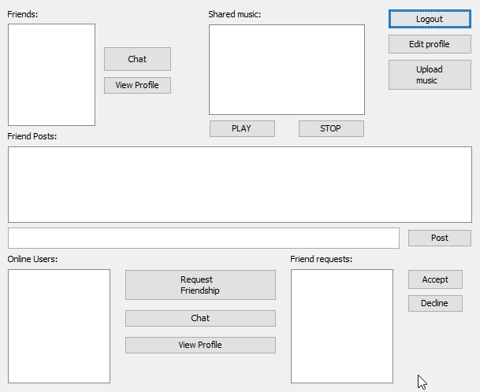
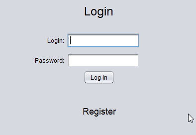

# Social Network in Java

A multi-threaded networking application written in Java allowing the users to upload music and share it with friends.

**Features:**
- Login/registration
- Friend system
- Image and music upload
- Music player
- Viewing users' profiles
- Chatting system
- SQL Database

Developed using Java Sockets

**Dependencies:**
- H2 Engine for embedded SQL support

**Usage:**  
- Start the server
- Start the chat server
- Connect with the clients
- Register
- Log in

### Screenshots

User Interface:

Login:  

